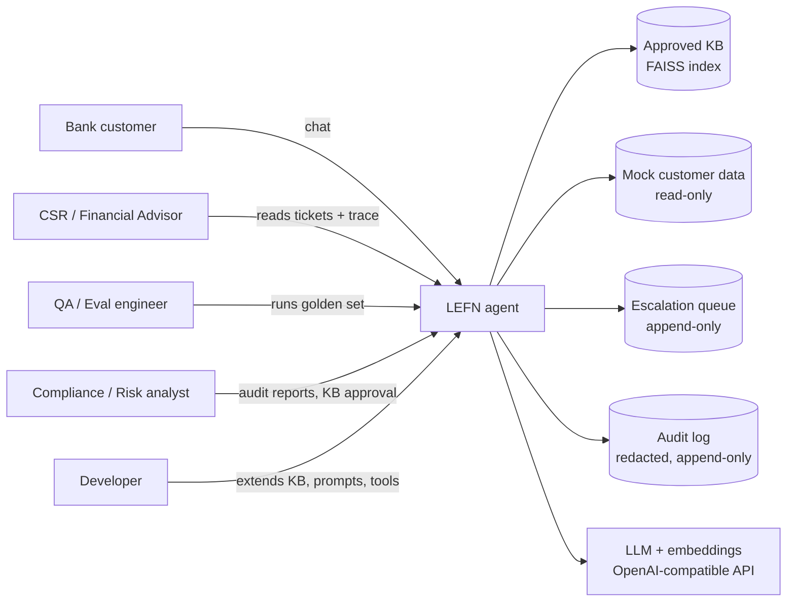
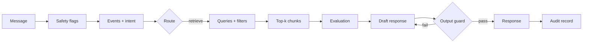

# 01 Architecture Overview

*Formal references: SRS Sections 1.6, 3, 4, 6.*

## 1. System context



There is **no** connection to any payment, core-banking or web-search system. That absence is a safety feature.

## 2. Layered architecture

```
+---------------------------------------------------------------------+
| PRESENTATION   CLI chat | optional Gradio UI | CSR console | Eval CLI |
+---------------------------------------------------------------------+
| ORCHESTRATION  LangGraph state machine + in-session checkpointer     |
+---------------------------------------------------------------------+
| AGENT NODES    safety classifier | event detector | retrieval planner |
| (LLM, bounded) evaluator | grounded generator | groundedness verifier |
+---------------------------------------------------------------------+
| SERVICES       FAISS retriever | customer service (read-only)        |
| (no LLM)       escalation queue | audit log | redaction | config     |
+---------------------------------------------------------------------+
| PLATFORM       OpenAI-compatible LLM + embeddings | config.env         |
+---------------------------------------------------------------------+
```

**Why layered?** Each layer can be tested alone. Deterministic code (router, guards, services) is unit-tested with no network; LLM nodes are tested with recorded responses; only the top-level evaluation uses the live model.

## 3. Component catalogue

| Component | Responsibility | Type | SRS |
|---|---|---|---|
| `input_guard` | Classify each message into safety flags (transaction, privacy, advice, fraud, injection) | LLM + rules | FR-2 |
| `detect_events` | Extract events with status, subject, confidence, evidence, stated attributes; classify intent | LLM (structured) | FR-3 |
| `route` | Choose the next step using fixed precedence rules | Deterministic code | FR-4, s.7 |
| `clarify` / `confirm_offer` | Ask one question, or offer to explain documented topics | LLM-light + templates | FR-4 |
| `load_customer_context` | Fetch allow-listed read-only facts for the logged-in customer | Service | FR-7 |
| `plan_retrieval` | Turn events and questions into 1-3 queries with filters | LLM + templates | FR-5.4 |
| `retrieve_policy` | Filtered FAISS search over approved docs | Service | FR-5 |
| `evaluate_retrieval` | Judge relevance, sufficiency, conflicts, missing info | LLM + thresholds | FR-6 |
| `generate_answer` | Produce structured, cited, hedged response | LLM | FR-8, 9 |
| `output_guard` | Validate citations, numbers, advice, PII, refusal notices | Rules + LLM verifier | FR-12 |
| `escalate` | Build handoff ticket, route to right queue | Service | FR-11 |
| `finalize` / `audit_log` | Render response, write redacted audit record | Service | FR-13 |

## 4. Technology stack

| Concern | Choice | Why |
|---|---|---|
| Language | Python 3.11+ | Matches reference projects |
| Orchestration | LangChain + **LangGraph** | Explicit state machine, checkpointing, easy tracing; graph maps 1:1 to the workflow diagram |
| LLM | `gpt-4o-mini` | Cheap, fast, supports structured outputs; configurable |
| Embeddings | `text-embedding-3-small` | Same as UdaPlay; good quality per cost |
| Vector DB | FAISS (local) | Zero infrastructure, persistent with `save_local` |
| Schemas | Pydantic v2 + `json-repair` | Typed outputs; graceful recovery from malformed JSON |
| Config | `python-dotenv` (`config.env`) | Same pattern as reference projects |
| Tests | pytest, pytest-cov, ruff | Standard, fast |
| UI | `rich` CLI; optional Gradio | Demo-ready without front-end work |

## 5. Key design decisions (ADR-lite)

| # | Decision | Rationale | Alternatives considered |
|---|---|---|---|
| D-1 | LangGraph state machine | Auditable, testable flow; conditional edges are explicit | Free-form ReAct agent: more flexible, far harder to prove safety |
| D-2 | **Routing in code, not by the LLM** | Safety-critical branching must be deterministic and unit-testable | LLM decides tools: risk of skipping safeguards |
| D-3 | **No web-search fallback** | Answers must come from *approved* policy only; unlike UdaPlay's Tavily fallback | Web fallback: rejected as unsafe for banking guidance |
| D-4 | Read-only tool registry, asserted by test | Transaction safety by construction, not by prompt wording | Prompt-only refusal: bypassable |
| D-5 | Customer ID bound to session, never an LLM argument | Prevents "look up C-1002" attacks | Let LLM pass IDs: privacy risk |
| D-6 | Retrieved and user text are untrusted data | Blocks injection via KB or messages | Trusting KB content: unsafe |
| D-7 | Two-layer hallucination defence | Cheap deterministic checks (numbers, IDs) + LLM verifier | Verifier only: LLM judging LLM |
| D-8 | Pydantic structured outputs everywhere | Machine-checkable, enables guards and metrics | Free text: hard to test |
| D-9 | Session-only memory | No customer facts persisted across sessions | Long-term memory: privacy burden, out of scope |
| D-10 | Escalation is a first-class outcome | Safe stopping is success, not failure | Always answer: unsafe |

## 6. Data flow for one turn



State carried through the graph (`GraphState`): session context, message history, safety assessment, detected events, pending offer, active events, customer context, retrieval queries and chunks, evaluation, draft/final response, counters (retries, clarification turns, guard failures), trace ID.

## 7. Repository layout

```
lefn/
  config.env.example  requirements.txt  README.md
  data/  kb/  kb_fixtures/  customers/  eval/  escalations/  audit/  faiss_index_lefn/
  src/lefn/
     config.py schemas.py state.py prompts.py graph.py
     guards/  nodes/  rag/  services/  tools/  app/  eval/
  tests/  unit/  component/  graph/  scenarios/
  notebooks/  LEFN_01_KnowledgeBase_RAG.ipynb
              LEFN_02_Agent_Workflow.ipynb
              LEFN_03_Evaluation.ipynb
  docs/  wiki/  specs/
```

## 8. Tool registry (all read-only or append-only)

| Tool | Purpose | Notes |
|---|---|---|
| `detect_life_events` | Events + intent | LLM structured output |
| `assess_request_safety` | Safety flags | LLM + pattern rules |
| `retrieve_policy` | Filtered semantic search | Approved + customer-audience only, enforced in the wrapper |
| `evaluate_retrieval` | Sufficiency judgement | Returns confidence, `is_sufficient`, reasoning, conflicts, missing info |
| `get_customer_profile` | Allow-listed customer facts | **No ID argument**; uses session identity |
| `escalate_to_human` | Create/offer handoff ticket | Append-only |
| `verify_groundedness` | Find unsupported claims | LLM verifier |
| `log_audit_event` | Write audit record | Append-only, redacted |

An automated test (`TOOLS_ARE_READ_ONLY`) fails the build if any other tool appears.

## 9. Runtime and deployment view

Everything runs **locally**: one Python process, a local FAISS folder, JSONL files for tickets and audit, and outbound calls only to the LLM API. That keeps the capstone reproducible and removes infrastructure risk. A production version would swap JSONL for a database, add real authentication, and put the KB behind a governed publishing pipeline (out of scope).

## 10. Extensibility

To add a new life event (for example *divorce/separation*, currently a known taxonomy gap): add the enum value, write KB documents, add required-attribute hints, add test cases. The graph, guards and router need **no** changes.
