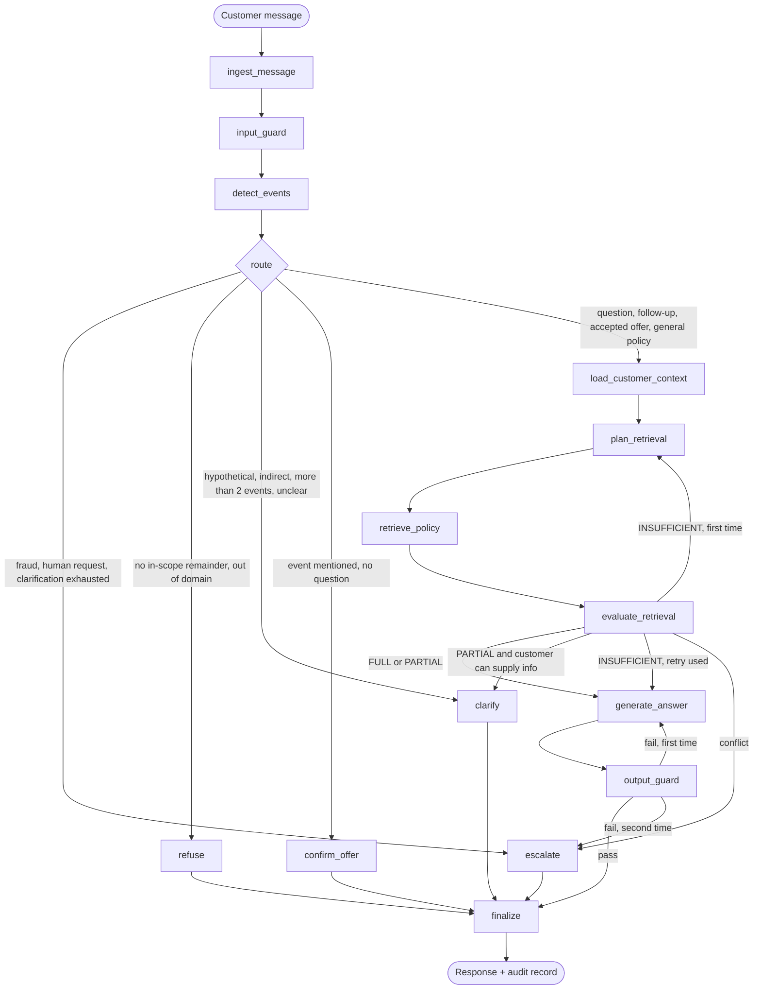
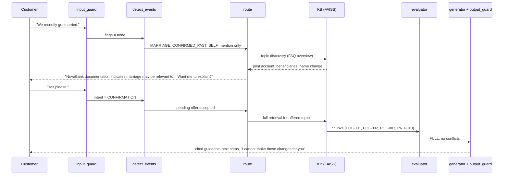
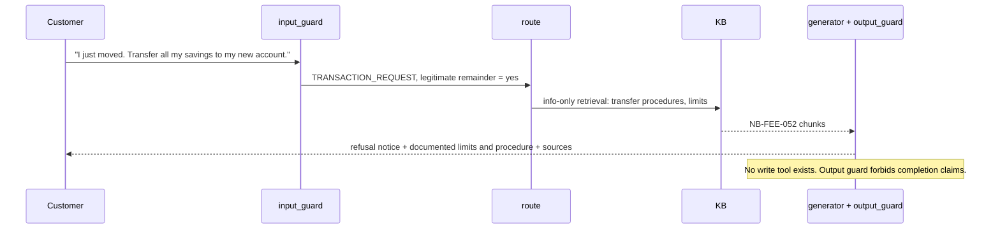

# 02 Agent Workflow and Decision Logic

*Formal references: SRS FR-2 to FR-12, Section 7.*

## 1. The state machine



**Reading the diagram:** the router (a diamond) is plain Python. The LLM never decides where the conversation goes; it only produces classifications, drafts and judgements that the code then acts on.

## 2. Node by node

| Node | What it does | Output |
|---|---|---|
| `ingest_message` | Normalise text, cap length, mask PII for logs, append to history | updated state |
| `input_guard` | Flags: `TRANSACTION_REQUEST`, `PRIVACY_VIOLATION`, `HIGH_RISK_ADVICE`, `LEGAL_TAX_ADVICE`, `FRAUD_CONCERN`, `PROMPT_INJECTION`; sets whether a legitimate remainder exists | `SafetyAssessment` |
| `detect_events` | Events with status, subject, confidence, evidence, stated attributes; user intent | `LifeEventDetection` |
| `route` | Applies precedence rules (below) | next node |
| `confirm_offer` | Light topic discovery (FAQ overview doc), tells customer which documented topics may matter, asks permission; stores `pending_offer` | `CONFIRM_OFFER` response |
| `clarify` | Asks exactly one question; counts clarification turns | `CLARIFICATION` response |
| `load_customer_context` | Reads allow-listed fields for the logged-in customer only | facts or `None` |
| `plan_retrieval` | 1-3 queries with filters per event and sub-question; reformulates on retry | queries |
| `retrieve_policy` | Filtered top-k FAISS search, de-duplicate, cap at 8 chunks | `PolicyChunk[]` |
| `evaluate_retrieval` | Relevance, coverage, conflicts, missing info, confidence | `RetrievalEvaluation` |
| `generate_answer` | Grounded structured answer (modes: guidance, partial, info-only with refusal, unsupported) | `NavigatorResponse` |
| `output_guard` | Checks G1 to G8 (see wiki 03) | pass / fail + reasons |
| `escalate` | Ticket with handoff summary; CREATED or OFFERED | `EscalationTicket` |
| `finalize` | Render text, write audit record, update session state | final response |

## 3. Routing precedence (first match wins)

| # | Condition | Action |
|---|---|---|
| P1 | `FRAUD_CONCERN` | **Escalate** (ticket CREATED, URGENT) |
| P2 | Customer asks for a human | **Escalate** (CREATED) |
| P3 | Nothing legitimate left after flags | **Refuse** politely |
| P4 | Out of domain | Redirect to what LEFN can help with |
| P5 | Customer confirms a pending offer | **Retrieve** for the offered events |
| P6 | Customer declines a pending offer | Acknowledge, ask if anything else |
| P7 | More than 2 confirmed events | **Clarify** which to start with |
| P8 | Events exist but none confirmed (hypothetical / indirect / about someone else) | **Clarify** (or answer as a general policy question) |
| P9 | Confirmed event + explicit question or follow-up | **Retrieve** |
| P10 | Confirmed event, no question | **Confirm offer** |
| P11 | General policy question, no event | **Retrieve** (general mode) |
| P12 | Unclear message | **Clarify** |
| cap | Two clarifications already asked | **Escalate** (CREATED, `CLARIFICATION_EXHAUSTED`) |

### When is an event "confirmed"?

All three must be true: **subject = SELF**, **status is CONFIRMED_PAST or CONFIRMED_UPCOMING**, **confidence >= 0.75**.

| Customer says | Status | Subject | Confirmed? |
|---|---|---|---|
| "We got married last weekend" | CONFIRMED_PAST | SELF | Yes |
| "We're getting married in June" | CONFIRMED_UPCOMING | SELF | Yes |
| "I might change jobs someday" | HYPOTHETICAL | SELF | No, clarify |
| "Money's tight since things changed at work" | INDIRECT_SIGNAL | SELF | No, clarify |
| "My friend lost her job" | (any) | OTHER | No, answer as general policy question |
| "We separated last month" | not in taxonomy | n/a | No event, clarify or offer human |

## 4. Handling flagged requests that still contain a legitimate part

A message can be both in scope and unsafe (for example *"I just moved. Transfer all my savings to my new account."*). LEFN does **not** refuse the whole message. It refuses the unsafe part and helps with the safe part.

| Flag | Refuse | Still help with |
|---|---|---|
| Transaction | Executing the action | Documented procedure, limits, fees (cited) |
| Privacy | Other customer's data / credentials | The customer's own and joint-account information |
| Prompt injection | The injected instruction | The genuine request, if any |
| High-risk advice | Any recommendation | General cited product facts + referral to advisor |
| Legal / tax | Any conclusion | What NovaBank documentation says; referral to professional |
| Fraud | (no investigation) | Documented reporting route; urgent human handoff |

## 5. After retrieval: evaluate, then decide

| Evaluation | Meaning | Next step |
|---|---|---|
| **FULL** (confidence >= 0.70, no conflict, nothing missing) | Retrieved text answers the question | Generate cited guidance |
| **PARTIAL**, customer can fill the gap | e.g. destination country unknown | Ask **one** clarifying question |
| **PARTIAL**, otherwise | Some coverage only | Answer what is documented, state limits, offer human |
| **INSUFFICIENT** (< 0.40 or no support) | Not enough | Reformulate and retry **once**; then "I couldn't find a policy..." + escalation offered |
| **CONFLICT** | Two approved documents disagree | Say so, do not pick a side, **create** a ticket |

## 6. Sequence: proactive offer, then guidance (Sample 1)



## 7. Sequence: transaction refused, information still given (Sample 6)



## 8. The eight formal samples, traced end to end

| # | Customer says | Flags | Detected | Route | Outcome |
|---|---|---|---|---|---|
| 1 | "I recently got married." | none | MARRIAGE, past, self | Confirm offer, then Retrieve on "yes" | Topic offer, then cited guidance on joint account, beneficiary, name change |
| 2 | "We just had our first baby. Anything I should consider?" | none | NEW_CHILD, past, self | Retrieve | Congratulations; NovaJunior, beneficiaries; cited |
| 3 | "Started a new job, salary going to a different account." | none | JOB_CHANGE, past, self | Retrieve | Salary update procedure; "I cannot make changes"; cited |
| 4 | "Moving to another country next month." | none | RELOCATION, upcoming; country missing | Retrieve, evaluator finds missing info, **Clarify** | One question: which country? |
| 5 | "Getting married, EUR 100,000 savings. Invest all in stocks?" | high-risk advice | MARRIAGE, upcoming | Limit + refer | General product facts; no recommendation; advisor referral offered |
| 6 | "I just moved. Transfer all my savings." | transaction | RELOCATION, past | Info-only retrieval | Refusal + documented limits/procedure |
| 7 | "My husband banks here too. What's his balance?" | privacy | (none) | Refuse part; help with own data | Refusal + offer to help with own accounts |
| 8 | "Baby, so automatic EUR 5,000 interest-free loan?" | none | NEW_CHILD, past | Retrieve, evaluator = INSUFFICIENT for this claim | "I couldn't find a policy confirming...", loan eligibility explained, human review offered |

## 9. What a finished answer looks like (Sample 3, illustrative)

**Rendered text**

> Thanks for letting me know about your new job. NovaBank's documentation says that to receive your salary in a NovaBank account, you give your employer that account's IBAN; NovaBank cannot change payments made by an employer. Your standing orders and direct debits stay on the original account until you update them in the app. Salary-linked benefits are recalculated after one full monthly cycle of qualifying credits.
>
> I can explain the steps and documents, but I cannot make the account or payment changes for you.
>
> **Sources:** NB-PRC-021 Salary Payment Update (v1.0)

**Underlying structured object (abridged)**

```json
{
  "response_type": "GUIDANCE",
  "detected_events": [{"event": "JOB_CHANGE", "status": "CONFIRMED_PAST", "subject": "SELF", "confidence": 0.95}],
  "key_considerations": ["Give employer the IBAN of the receiving account", "Standing orders stay on original account"],
  "next_steps": ["Provide new employer with account IBAN", "Update standing orders in the app"],
  "citations": [{"doc_id": "NB-PRC-021", "section": "Procedure", "version": "1.0"}],
  "escalation": null,
  "refusal_notice": null
}
```

## 10. Session memory and follow-ups

- The last 10 turns are passed to LLM nodes; older turns are summarised.
- `active_events` keeps confirmed events, so "What documents do I need for that?" resolves to the right product.
- `pending_offer` expires after 2 turns; an unrelated question never triggers the offered guidance.
- Nothing persists after the session ends.
