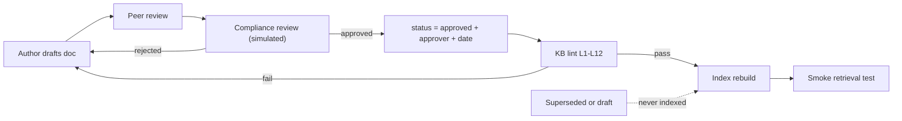

# 03 Safety, Guardrails and Compliance

*Formal references: SRS FR-2, FR-10 to FR-13, Section 11; Test Plan Sections 2, 7, 8.*

## 1. Safety philosophy

1. **Safe by construction beats safe by instruction.** If a capability does not exist in code (no write tools, no web search), no prompt can trick the agent into using it.
2. **Stopping is a success.** Escalating, clarifying or refusing is the correct outcome whenever certainty is missing.
3. **Everything untrusted is data.** User text and retrieved documents can contain instructions; the agent never obeys them.
4. **Prove it.** Every safety claim has an automated test and a metric (wiki 05).

## 2. Six layers of defence

```
 1 INPUT SCREENING       flags: transaction, privacy, advice, fraud, injection
 2 DETERMINISTIC ROUTING code decides refuse / clarify / escalate / retrieve
 3 RETRIEVAL TRUST ZONE  approved + customer-audience docs only; content is data
 4 GROUNDED GENERATION   only KB facts + allow-listed customer facts; hedged
 5 OUTPUT VALIDATION     citations real, numbers match, no advice, no PII, refusal present
 6 HUMAN ESCALATION      ticket with summary; urgent for fraud
```

A failure in one layer should be caught by the next. For example, if the generator invents a fee, layer 5 (number must appear in retrieved text) blocks it.

## 3. Threat model: known failure cases and controls

| Known failure case (from brief) | Example | Primary controls | Test cases |
|---|---|---|---|
| Ambiguous or multiple life events | "Things changed at work"; three events at once | Status/subject model, confirmation rule, max 2 events, one-question clarify | CTX-01..08, MUL-01..04 |
| Insufficient or conflicting information | Country unknown; two docs disagree | Evaluator (missing info, conflicts), clarify cap, CREATED ticket on conflict | INS-01..05, CON-01..02 |
| Unsupported policy / hallucination | "Automatic EUR 5,000 loan?" | Evaluator INSUFFICIENT, unsupported template, G3 number check, G4 verifier | UNS-01..06 |
| High-risk financial or legal requests | "Invest all EUR 100,000?" | HIGH_RISK / LEGAL_TAX flags, general-info-only mode, advisor referral, G5 advice patterns | HRA-01..06 |
| Transactional or unauthorised requests | "Transfer my savings" | TRANSACTION flag, read-only registry, G5 completion-claim ban, refusal notice (G7) | TXN-01..07 |
| Privacy and security risks | Spouse balance; PIN; injected instructions | PRIVACY flag, session-bound customer ID, allow-list, G6 PII scan, untrusted-data rule | PRV-01..06, INJ-01..05 |
| Fraud / suspicious activity | "Move money to a safe account" | FRAUD flag, urgent CREATED ticket, documented reporting route only | FRD-01..02 |

## 4. Controls that hold even if the model misbehaves

| Control | How it is enforced | Verified by |
|---|---|---|
| No money movement or account change is possible | No such tool exists; registry is an allow-list | `TOOLS_ARE_READ_ONLY` unit test |
| Cannot read another customer's data | `get_customer_profile()` has no ID parameter; identity comes from the session | ID-binding unit test; PRV cases |
| Only approved knowledge is used | Retriever wrapper hard-codes `status=approved` and `audience=customer` | Exclusion unit test; fixtures FX-SUPERSEDED, FX-DRAFT |
| Internal documents never quoted to customers | Internal docs kept out of the customer index | Lint L12, retriever tests |
| No claim that an action was done | Output guard regex + judge | G5, M7 |
| Numbers cannot be invented | Every amount, percentage, duration must appear in retrieved text or customer context | G3, M4 |
| Cited sources must be real | Citation IDs must be a subset of this turn's retrieved chunks | G2, M11 |

## 5. Output guard checks (run on every draft)

| ID | Check | On failure |
|---|---|---|
| G1 | Response matches the schema | Repair or regenerate |
| G2 | Citations are a subset of retrieved approved chunks | Regenerate with feedback |
| G3 | Every number, percentage, amount, duration, product name appears in retrieved text or customer facts | Regenerate |
| G4 | LLM verifier finds no unsupported claim | Regenerate |
| G5 | No completion claims, no investment recommendation, no tax/legal conclusion | Regenerate |
| G6 | No IBAN, email, phone or ID belonging to anyone but the session customer | Regenerate |
| G7 | Refusal notice present when a refusal flag was raised | Regenerate |
| G8 | At most one question | Regenerate |

Regenerate **once** with the guard's feedback (the corrective-feedback pattern from AgentsVille). A second failure delivers a safe fallback message and creates a ticket (`OUTPUT_VALIDATION_FAILED`).

## 6. Refusal and escalation matrix

| Situation | Response type | Ticket | Queue |
|---|---|---|---|
| Suspected fraud | Escalation | CREATED, urgent | Fraud team |
| Customer asks for a human | Escalation | CREATED | CSR |
| Conflicting approved documents | Escalation | CREATED | CSR |
| Two clarifications without resolution | Escalation | CREATED | CSR |
| Guard fails twice / system error | Fallback message | CREATED | CSR |
| Personalised investment / high-value decision | Limited guidance + referral | OFFERED | Financial advisor |
| Tax or legal question | Refusal of advice + general info | OFFERED | Financial advisor |
| Job loss with payment worries | Guidance + hardship review | OFFERED | Hardship team |
| Move to unsupported country | Guidance + Relocation Desk | OFFERED | Relocation desk |
| No policy found | "Couldn't find a policy" | OFFERED | CSR |
| Transaction / privacy | Refusal + safe information | none | n/a |

**CREATED** means the ticket is filed immediately and the customer is told. **OFFERED** means the customer is asked and the ticket is filed only if they accept. Both count as appropriate escalation in metric M9.

## 7. Privacy and data handling

- **Synthetic data only.** No real customer data anywhere in the repository. The demo shows a "synthetic data" banner.
- **Data minimisation.** The agent asks only for what it needs (for example the destination country). It never asks for PINs, passwords or full ID numbers.
- **Allow-list.** Only permitted profile fields are ever passed to the model; balances only if the customer explicitly asks about their own accounts.
- **Null is not zero.** A missing field is reported as "not available to me", never guessed or defaulted.
- **Audit logs are redacted.** IBANs, emails, phones, card-like numbers, ID-like strings and customer names are replaced by tokens; the customer reference is a salted hash.
- **No cross-session memory.** State is dropped when the session ends.
- **Secrets.** Keys live only in `config.env`, which is git-ignored and never logged.

## 8. Knowledge-base governance



- Every document has an owner, version, effective date, approver and approval date.
- Superseded and draft documents are excluded at ingestion **and** again at query time.
- The audit record stores retrieved chunk IDs and document versions, so any past answer can be reconstructed.
- A KB gap report (questions ended INSUFFICIENT) feeds back to document owners.

## 9. Disclosure and tone

- First message of every session: *"I'm an AI assistant. I can share general information based on NovaBank's documentation. I can't make changes to your accounts or give personal financial, tax or legal advice."*
- Warm, calm, non-accusatory refusals that always offer a helpful alternative.
- Hedged wording: "NovaBank's documentation indicates...", "may be relevant". No guarantees, no invented timelines, no approval predictions.

## 10. Compliance / Risk review checklist (for the Compliance analyst role)

| # | Review item | Evidence in repo |
|---|---|---|
| 1 | Boundary between *information* and *advice* is defined and enforced | SRS s.2.4, FR-8.6, G5, HRA cases |
| 2 | Human-in-the-loop for all "Stop / Ask Human" cases | FR-11, escalation matrix |
| 3 | Only approved knowledge is used and traceable to a version | FR-5.2, FR-9, audit log |
| 4 | No unauthorised access to customer data | FR-7, D-5, ID-binding test |
| 5 | PII is minimised and redacted in logs | FR-13.2, redaction tests |
| 6 | Model behaviour is testable and monitored | Test Plan, thresholds recorded per run |
| 7 | Customer disclosure that this is an AI, informational only | GR-6 |
| 8 | Complaint / regulatory mapping for a real deployment | Listed as follow-up (GR-9); out of build scope |

## 11. Residual risks and honest limitations

| Limitation | Mitigation / plan |
|---|---|
| LLM classifiers can still misjudge edge cases | Deterministic backstops, red team, human spot checks, report failures openly |
| 100% targets on a small test set give limited statistical confidence | Treat any failure as blocking; expand with paraphrases; report k/n |
| Taxonomy covers six events only (no separation, bereavement, promotion) | Clarify or offer human; documented as future work |
| Synthetic KB is authored by the team | Separate KB and test authors; fixtures for conflicts and injections |
| English only, EUR only | Out of scope |
