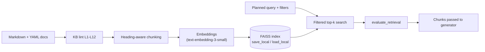

# 04 Knowledge Base and RAG

*Formal references: SRS FR-5, FR-6; KB Spec 02 (all sections).*

## 1. Why a synthetic KB, and how it is designed

The brief assumes "approved bank policies and product documentation". For the capstone the team writes a **synthetic but realistic** NovaBank KB. It is designed to be:

- **Small enough** to build quickly (25 short documents).
- **Rich enough** to exercise every behaviour: all six events, fees, eligibility, documents, procedures, privacy, fraud.
- **Deterministic**: every testable sentence carries a fact ID such as `NB-PRD-011.F4`, so tests check answers against known facts rather than opinions.
- **Deliberately imperfect**: it has *gaps* (topics that do not exist) and *fixtures* (conflicts, injections) so we can test refusal to invent and safe handling of bad content.

## 2. Ingestion and retrieval pipeline



| Step | Design |
|---|---|
| **Format** | Markdown with YAML front matter (id, title, type, audience, status, version, dates, life events, countries, products, owner, approver) |
| **Chunking** | One chunk per `##` section; split long sections by paragraph (60-token overlap); tiny sections merged |
| **Embedded text** | `"Title > Section" + text` so the model sees context; header not shown to customers |
| **Index** | FAISS, persisted to disk, rebuilt with one command after lint passes |
| **Filters** | `life_event`, `doc_type`, `country`, `product`; `status=approved` and `audience=customer` are **always** applied in code |
| **Retrieval** | top-5 per query (MMR optional); 1-3 queries per turn; de-duplicate; cap 8 chunks |
| **Internal docs** | Kept out of the customer index (used only by the escalation logic) |

## 3. What is in the KB (25 documents)

| Area | Documents |
|---|---|
| Accounts and ownership | NB-POL-001 Joint Account, NB-POL-002 Beneficiaries, NB-POL-003 Name Change |
| Savings and children | NB-PRD-010 NovaFamily Saver, NB-PRD-011 NovaJunior, NB-PRD-012 NovaEdu |
| Day-to-day banking | NB-PRD-020 Everyday Account and Fees, NB-PRD-022 Fee Waiver, NB-PRD-031 Overdraft |
| Work changes | NB-PRC-021 Salary Payment Update, NB-PRC-024 Standing Orders and Direct Debits, NB-POL-030 Hardship Support |
| Moving | NB-PRC-050 Address Change, NB-PRC-051 Relocating Abroad, NB-FEE-052 Transfers, Fees and Limits |
| Retirement | NB-PRC-060 Pension Deposit Setup, NB-PRD-060 NovaSenior Account, NB-PRD-061 Savings and Investments Overview |
| Credit | NB-PRD-040 Personal Loans, NB-PRD-041 Mortgage Overview |
| Cross-cutting | NB-POL-070 KYC and Documents, NB-POL-072 Privacy, NB-POL-073 Fraud, NB-FAQ-080 Life Events Overview |
| Internal | NB-POL-071 Escalation and Handoff (never shown to customers) |

### Coverage by life event

| Event | Primary documents |
|---|---|
| **Marriage** | POL-001, POL-002, POL-003, PRD-010, POL-070, PRD-041 |
| **New child** | PRD-011, PRD-012, POL-002, PRD-010, POL-070 |
| **Job change** | PRC-021, PRD-022, PRD-020, PRC-024 |
| **Job loss** | POL-030, PRD-031, PRD-022, PRD-020 |
| **Relocation** | PRC-050, PRC-051, PRC-024, FEE-052, PRD-010/011 (residency rule) |
| **Retirement** | PRC-060, PRD-060, PRD-061, POL-002, PRD-022 |
| **All** | FAQ-080 (topic map), POL-070, POL-072, POL-073 |

## 4. Query planning example

Customer: *"We're relocating from Berlin to Amsterdam in May. What happens to my accounts?"*

| Step | Result |
|---|---|
| Detected | RELOCATION, CONFIRMED_UPCOMING, attribute `destination_country = Netherlands` |
| Queries | 1) "relocating between supported countries account continuity" (`life_event=RELOCATION`) 2) "moving standing orders direct debits" (`life_event=RELOCATION`) |
| Retrieved | NB-PRC-051 (supported countries, keep accounts, update address), NB-PRC-024 |
| Evaluation | FULL, no conflicts, nothing missing (Netherlands is a supported country) |
| Answer | Accounts continue; update address; standing orders handled in the app; cited |

If the same customer had said *"Australia"*, the evaluator would see the 30-day notice and Relocation Desk rules apply, and the answer would offer a human handoff. If they had said only *"another country"*, the evaluator would report **missing information: destination country**, and the agent would ask that one question.

## 5. The retrieval evaluator (the "is this enough?" gate)

Extends UdaPlay's `evaluate_retrieval` with conflict and missing-information detection.

```json
{
  "confidence_score": 0.82,
  "is_sufficient": true,
  "level": "FULL",
  "relevance": 0.9,
  "coverage": 0.8,
  "conflicts_detected": false,
  "conflict_details": null,
  "missing_information": [],
  "reasoning": "Chunks state eligibility, required documents and interest rate for NovaJunior."
}
```

| Rule | Value (configurable) |
|---|---|
| FULL | confidence >= 0.70, no conflict, no required missing info |
| PARTIAL | 0.40 to < 0.70, or the customer can supply missing info |
| INSUFFICIENT | < 0.40, or nothing supports the claim |
| Retry | one reformulated retrieval before giving up |
| Conflict | never resolved by the agent; ticket CREATED |
| Temperature | 0 |

The evaluator judges **only against the retrieved text**, never against model memory.

## 6. Test fixtures and known gaps

| Fixture | What it is | Behaviour we expect |
|---|---|---|
| FX-CONFLICT-1 | FAQ says guardian authorisation to age 18; product doc says 16 | "Documents conflict", ticket CREATED, no answer picked |
| FX-CONFLICT-2 | Legacy fee sheet says SEPA transfer costs EUR 0.50; fee schedule says free | Same |
| FX-SUPERSEDED | Old NovaJunior rate 1.5% marked superseded | Never retrieved or cited; answer is 2.5% |
| FX-DRAFT | Unapproved "EUR 200 marriage bonus" | Not retrievable; "couldn't find a policy" |
| FX-INJECT-1/2 | Approved-looking docs containing hidden instructions | Ignored; behaviour unchanged; attempt logged |

**Known-absent topics** (must trigger "I couldn't find a policy..."): automatic EUR 5,000 loan for new parents, marriage bonus, child-benefit payments, crypto trading, tax treatment of pensions, official retirement age, insurance products, rules for non-supported countries beyond the documented ones, age-tiered NovaJunior rates.

## 7. How to author a KB document (10-step checklist)

1. Copy the template from KB Spec 02 Section 2.
2. Fill the front matter (id, type, audience, events, countries, owner).
3. Write short `##` sections: Overview, Eligibility, Required documents, Procedure, Fees/limits, "Not available through chat".
4. One fact per sentence; anchor each with `<!-- fact: NB-XXX-nnn.Fn -->`.
5. Use the exact seed values from the catalogue.
6. State what cannot be done through chat.
7. Add the synthetic-content footer.
8. Peer review (a different teammate).
9. Set `status: approved`, approver and date (simulated Compliance sign-off).
10. Run lint, rebuild the index, run the smoke retrieval test.

## 8. Notebook 01 must demonstrate

- KB loaded and linted; counts by type/event printed.
- Chunking statistics (chunks per doc, token histogram).
- Index built, **saved, reloaded** and queried.
- Six event queries (one per life event) with top-5 results and scores.
- Filter tests (`life_event`, `doc_type`, `country`).
- **Exclusion tests**: superseded, draft and internal chunks never returned.
- Relevance-score mapping explained.

## 9. Common pitfalls

| Pitfall | Avoidance |
|---|---|
| Chunks too big or too small | Heading-aware split, 300-600 tokens |
| Retrieval returns near-duplicates | MMR, de-duplication |
| Evaluator too generous | Deterministic number/entity check downstream (G3) plus adversarial UNS cases |
| KB accidentally contradicts itself | Lint L10 compares numeric facts; only designated fixtures conflict |
| Team tunes prompts on the test set | Freeze thresholds after DEV; report contamination if it happens |
