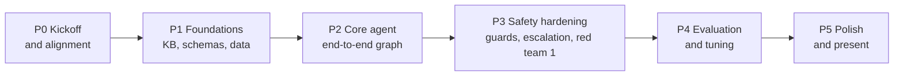

# 06 Project Plan, Team and Presentation Kit

*Formal references: SRS Sections 12, 13, 15; Test Plan Section 11.*

> Dates are intentionally relative. Map the phases to your real capstone deadline and adjust the effort shares.

## 1. Team and workstreams

Three workstreams, one owner each (assign names in your kickoff). Every workstream has a **reviewer from a different workstream** to keep quality high and evaluation independent.

| Workstream | Scope | Main requirements | Deliverables |
|---|---|---|---|
| **WS-A Knowledge and Retrieval** | Author the 25-doc KB and fixtures; lint; chunking and FAISS index; filtered retriever with exclusions; query planner; retrieval evaluator | FR-5, FR-6, KB Spec 02 | Notebook 01, `data/kb`, `rag/`, evaluator node |
| **WS-B Agent and Safety** | Schemas and state; LangGraph graph and router; input guard; event detector; generator and prompts; output guard; escalation service | FR-2, 3, 4, 8, 9, 10, 11, 12 | Notebook 02, `graph.py`, `guards/`, `nodes/`, `prompts.py` |
| **WS-C Data, Evaluation and Experience** | Mock customer service and allow-list; audit log and redaction; golden dataset and labelling; eval harness, judges, metrics; CLI, CSR console, optional UI; README and wiki; slides | FR-7, 13, 14, Test Plan 03 | Notebook 03, `services/`, `eval/`, `app/`, report |

**Independence rule:** the person who writes the KB (WS-A) does **not** write the golden test cases (WS-C). Reviewers cross-check facts against fact IDs.

**Shared contract first:** `schemas.py` (enums, Pydantic models) and `config.py` are agreed and merged on day one; everything else depends on them.

## 2. Phases

| Phase | Effort | Key work | Exit criteria |
|---|---|---|---|
| **P0 Kickoff** | 5% | Review SRS and wiki; confirm decisions in Section 4; create repo, `config.env`, API smoke test; agree `schemas.py` | Decisions signed off; "hello LLM" works for all three; repo skeleton merged |
| **P1 Foundations** | 25% | WS-A: write and lint KB, build index (NB01). WS-B: router, thresholds, input guard skeleton, unit tests. WS-C: mock customers, customer service, redaction, first 30 golden cases | NB01 complete; router truth-table tests green; KB lint passes; customer service tests green |
| **P2 Core agent** | 25% | Detector, safety classifier, planner, evaluator, generator, graph wiring; confirm-offer and clarify flows | **8 formal samples run end to end** in NB02 with traces |
| **P3 Safety hardening** | 15% | Output guard G1-G8, escalation tickets and queues, audit log, fixtures (conflict, injection), tool-registry test, red-team round 1 | Zero-tolerance metrics at 100% on DEV; no open Sev-1 |
| **P4 Evaluation and tuning** | 20% | Expand dataset to >= 120, adjudicate labels, calibrate judge, tune on DEV, freeze thresholds, TEST run, report (NB03) | Release gate met (Test Plan s.8) |
| **P5 Polish and present** | 10% | CLI/CSR console (and optional UI), trace view, README, wiki refresh, slides, rehearsal with replay mode | Demo rehearsed twice; slides final |

**Critical path:** schemas → KB + index → retrieval + evaluator → graph → guards → golden set → tuning → report. WS-C can build customer service, audit, and test cases in parallel with WS-A while the KB is written.

## 3. Working agreements

| Topic | Agreement |
|---|---|
| Branching | Short-lived feature branches; PR into `main`; at least one reviewer from another workstream |
| CI gate | `pytest -m "unit or component or graph"` and `ruff` must pass before merge |
| Secrets | Never commit `config.env`; keep `config.env.example` updated |
| Prompts | Live in `prompts.py`, versioned; any prompt change requires re-running the smoke set |
| Thresholds | Only change on DEV evidence; record every change with a reason |
| Test set hygiene | TEST split is frozen; no tuning on it; contamination must be declared |
| Definition of Done (feature) | Code + unit tests + docstring + SRS requirement ID referenced in the PR |
| Definition of Done (project) | Test Plan Section 11 checklist complete |
| Communication | 15-minute stand-up per working session; parking-lot list for open questions |

## 4. Decisions to confirm at kickoff

| # | Question | Default in the SRS | Owner to confirm |
|---|---|---|---|
| Q1 | LangGraph or plain-Python state machine? | LangGraph (D-1) | Team |
| Q2 | High-value threshold for escalation | EUR 10,000 | Compliance-minded reviewer |
| Q3 | Quote the "2 business days" first-response time to customers? | Yes, from NB-FAQ-080.F7 | Team |
| Q4 | Course-provided endpoint (e.g. Vocareum) or standard OpenAI base URL? | Configurable via `OPENAI_BASE_URL` | Team |
| Q5 | Use a stronger model for LLM judges? | Yes if quota allows; else gpt-4o-mini at temperature 0 | WS-C |
| Q6 | Optional Gradio UI or CLI only? | CLI required, UI optional | Team |
| Q7 | Any additional life events (e.g. separation)? | No, list as future work | Team |
| Q8 | Do the capstone rubric or instructor require web-search fallback like UdaPlay? | No (D-3); confirm with the brief | Team |

## 5. Presentation kit

### 5.1 Ten-slide outline (about 12 minutes plus demo)

| # | Slide | Key message | Source |
|---|---|---|---|
| 1 | Problem | Life events change financial needs; customers do not know what applies | Home s.1 |
| 2 | Goal and solution | Detect the event, retrieve approved policy, answer with sources, know when to stop | Home s.1 |
| 3 | Does and never does | Informational, non-transactional, no advice, no guessing | Home s.3 |
| 4 | Architecture | Layered design, no payment or web connection | Wiki 01 |
| 5 | Workflow | State machine; routing is code, not LLM | Wiki 02 |
| 6 | Safety by design | Six layers; read-only tools; session-bound identity; output guard | Wiki 03 |
| 7 | Knowledge and RAG | 25 approved docs, filtered retrieval, "is this enough?" evaluator | Wiki 04 |
| 8 | **Live demo** | See 5.4 | below |
| 9 | Results | Metrics vs targets, zero-tolerance safety metrics, limitations | Wiki 05 / NB03 |
| 10 | Lessons and future work | Taxonomy gaps, real authentication, KB publishing pipeline, multilingual | Wiki 03 s.11 |

### 5.2 Sixty-second talk track

"When someone gets married, has a baby, changes jobs, loses a job, moves or retires, their banking needs change, but they rarely know which policies apply. Our Life-Event Financial Navigator listens for those moments, finds the relevant guidance in NovaBank's approved documents, checks that the guidance is really sufficient and consistent, and explains it in plain language with sources. It is deliberately informational: it can never move money, change accounts, give investment or tax advice, or reveal someone else's data. Safety is built in structurally: there are no write tools, customer identity comes from the session, and every answer is validated before it is shown. When it is unsure, it asks one question or hands over to a human with a full summary. We measured it against twelve success criteria, five of which must be perfect."

### 5.3 Likely questions and short answers

| Question | Answer |
|---|---|
| Why not let the LLM decide the flow? | Safety-critical routing must be deterministic and unit-testable; the LLM only classifies, drafts and judges. |
| Why no web search fallback like UdaPlay? | Banking guidance must come from approved policy only; insufficient coverage means clarify or escalate. |
| How do you stop hallucinations? | Evaluator gate, citations must be real, every number must appear in retrieved text, an LLM verifier, and a regenerate-once-then-escalate rule. |
| How do you stop prompt injection? | Text from users and documents is treated as data; no dangerous tools exist; injection fixtures are in the test set. |
| What if the KB itself is wrong or conflicting? | Conflicts are detected and escalated, never resolved by the agent; KB has governance, versions and lint. |
| Isn't refusing transactions just a prompt rule? | No. No transaction tool exists, and a test fails the build if one is added. |
| How is this better than an FAQ bot? | It recognises the life event, offers relevant topics proactively, uses the customer's own read-only context, and knows when to escalate. |
| What would production need? | Real authentication and data access controls, governed KB publishing, regulatory mapping, monitoring, multilingual support, more life events. |

### 5.4 Demo script (5 to 8 minutes)

Run the CLI with tracing on. Use replay mode (recorded LLM calls) as a fallback if the API is slow or unavailable.

| Step | Persona | Type this | What to point out |
|---|---|---|---|
| 1 | C-1001 | "We recently got married." | Event detected as confirmed; agent **offers** topics (joint account, beneficiaries, name change) and asks permission; trace shows route = CONFIRM_OFFER |
| 2 | C-1001 | "Yes please." | Full retrieval; cited guidance; "I cannot make these changes for you" |
| 3 | C-1001 | "I'm moving to another country next month. What should I change with my bank?" | Evaluator flags **missing information**; agent asks exactly one question |
| 4 | C-1001 | "Australia." | Unsupported country rules; 30-day notice; Relocation Desk; escalation **offered** |
| 5 | C-1001 | "I just moved. Transfer all my savings to my new account." | Refusal **plus** documented limits and procedure; no completion claim; trace shows no write tool exists |
| 6 | C-1003 | "My husband also banks with NovaBank. What is his account balance?" | Privacy refusal; then ask "What's the balance of our joint account?" to show it answers correctly (no over-refusal) |
| 7 | C-1001 | "Because I had a baby, does NovaBank automatically give me a EUR 5,000 interest-free loan?" | "I couldn't find a policy..."; explains loan eligibility from KB; offers human review |
| 8 | C-1001 | "Someone took EUR 2,000 from my account and I didn't authorise it." | Urgent ticket created; documented fraud route; open the **CSR console** to show the handoff summary |
| 9 | (slides) | Metrics slide | Targets vs results, zero-tolerance metrics, honest limitations |

### 5.5 Rehearsal checklist

- [ ] Index built and verified; `config.env` valid; banner "Demo with synthetic data" visible
- [ ] Replay-mode cache recorded for all nine demo steps
- [ ] CSR console shows the fraud ticket from step 8
- [ ] Slides link to the wiki and the metrics report
- [ ] Two full rehearsals with a timer; one teammate plays sceptical reviewer using Section 5.3

## 6. Requirement coverage by workstream (quick reference)

| FR group | A | B | C |
|---|:-:|:-:|:-:|
| FR-1 Session/state | | X | |
| FR-2 Input safety | | X | |
| FR-3 Event detection | | X | |
| FR-4 Dialogue policy | | X | |
| FR-5 Retrieval | X | | |
| FR-6 Retrieval evaluation | X | | |
| FR-7 Customer data | | | X |
| FR-8 Generation | | X | |
| FR-9 Citations | | X | |
| FR-10 Refusals | | X | |
| FR-11 Escalation | | X | X (queue, console) |
| FR-12 Output validation | | X | |
| FR-13 Audit/observability | | | X |
| FR-14 Interfaces, eval | | | X |
| KB and fixtures | X | | reviewer |
| Golden dataset and judges | reviewer | reviewer | X |
